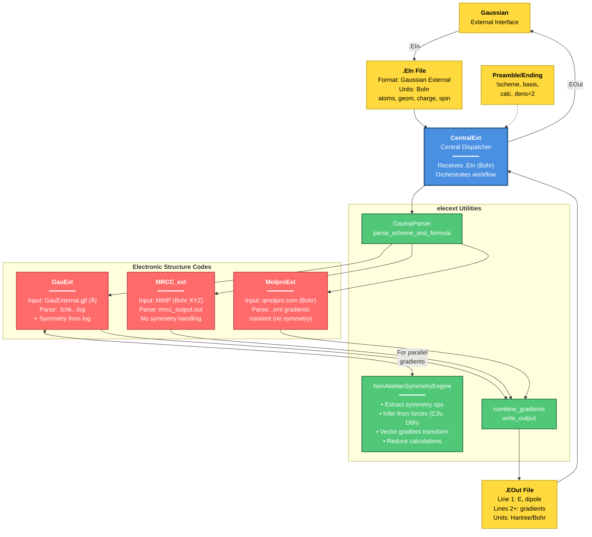

# Workflow ExternalMRCC - Integration with Electronic Structure Codes

## Overview Flowchart



## Data Objects and File Formats

### Input/Output Files

| File Type | Format | Units | Content |
|-----------|--------|-------|---------|
| **`.EIn`** | Gaussian External | Bohr | Geometry, atoms, charge, spin, opt_flag |
| **`.EOut`** | Gaussian External | Hartree/Bohr | Energy, dipole moment, gradients |
| **Preamble/Ending** | Custom | - | !scheme, basis, calc, dens=2 |

### Intermediate Files by Code

| Code | Input File | Format | Output Parsing |
|------|------------|--------|----------------|
| **Gaussian** | `GauExternal.gjf` | Angstrom | `.fchk`, `.log` files |
| **MRCC** | `MINP` | Bohr (XYZ) | `mrcc_output.out` |
| **Molpro** | `qmolpro.com` | Bohr (noorient) | `.xml` gradients |

## Non-Abelian Symmetry Treatment

The **NonAbelianSymmetryEngine** (used by GauExt for parallel gradients) implements:

1. **Extract Symmetry Operations** from Gaussian log files:
   - Nuclear permutations (atom mapping under symmetry)
   - 3×3 transformation matrices for coordinates/gradients

2. **Fallback: Infer from Force Patterns**:
   - When explicit operations unavailable
   - Test C₃, C₆ rotations for C3v, D3h, D6h point groups
   - RMSD matching < 10⁻⁵

3. **Vector Gradient Transformations**:
   - **grad[target] = T × grad[source]** (full vector, not component-wise)
   - Critical for non-Abelian groups (C3v, D6h, etc.)

4. **Computational Efficiency**:
   - **Example (C3v NH₃)**: 4-6 displacements instead of 12 (50% reduction)
   - **Example (D6h benzene)**: ~75% reduction in gradient calculations

## Key Variables Exchanged

### Python Objects

- **`geom`**: List of geometry strings (e.g., `["C 0.0 0.0 0.0", ...]`)
- **`atoms`**: Integer (number of atoms)
- **`charge`**: Integer (molecular charge)
- **`spin`**: Integer (spin multiplicity)
- **`opt_flag`**: Integer (0=energy only, 1=gradient calculation)
- **`gradient`**: NumPy array `(N_atoms, 3)` in Hartree/Bohr

### Scheme Operations

From Preamble files:
```
!scheme
! 1.0 -1.0 0.5     # Linear coefficients
!end

!formula           # Optional: non-linear combinations
!e = c1*e1 + c2*sqrt(e2) + c3*e3
!end
```

Operations types:
- `('coeff', value)`: Linear coefficient
- `('copy', index, coeff)`: Reuse gradient/energy from previous section
- Custom formulas: Support for `exp`, `log`, `sqrt`, trigonometric functions
